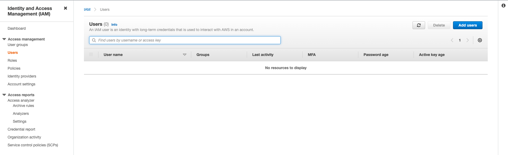
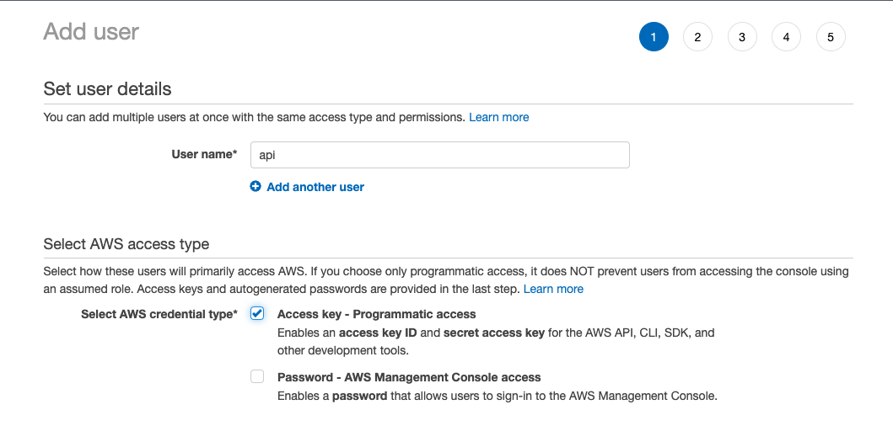
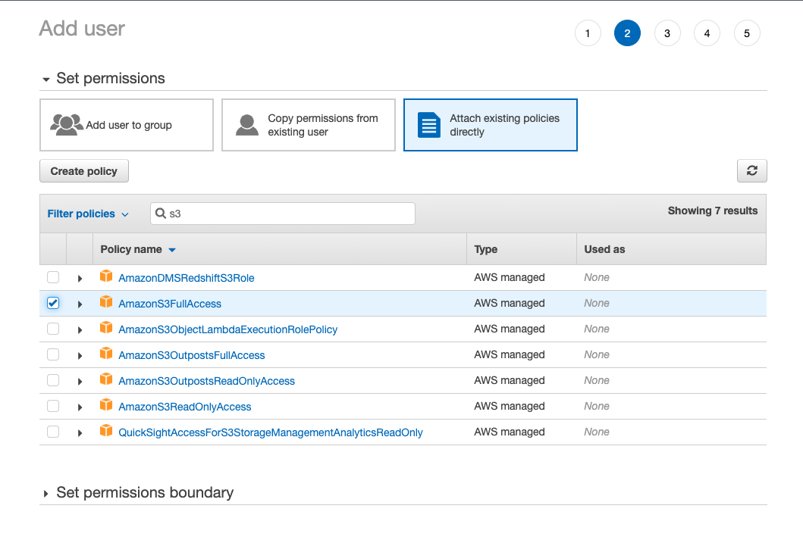
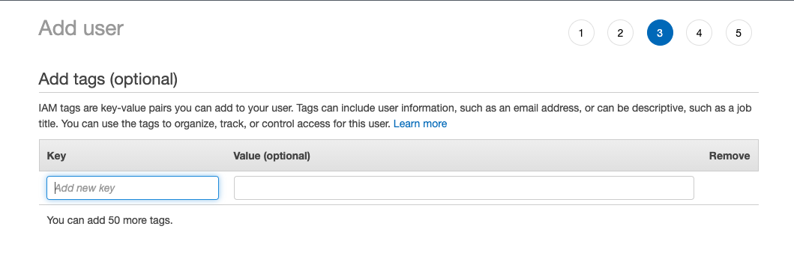
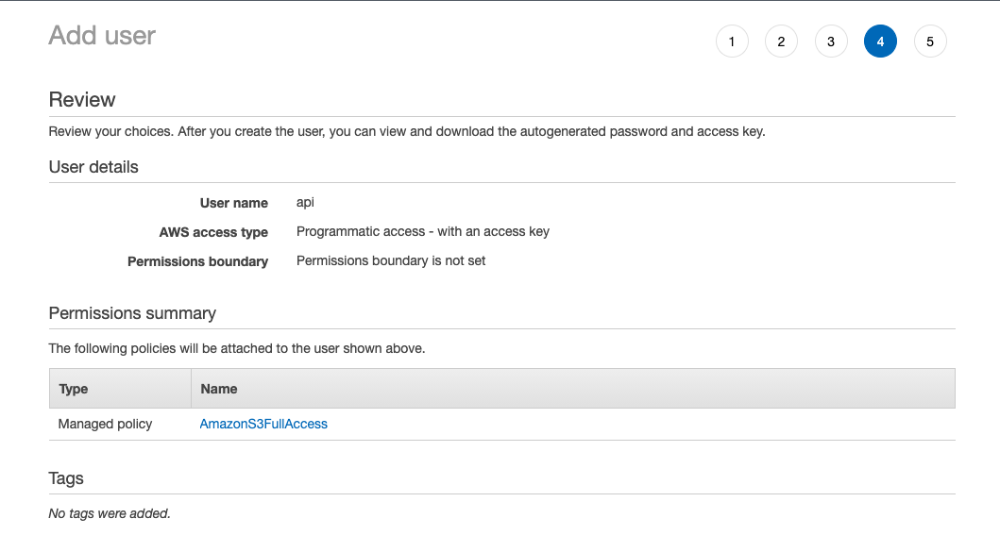
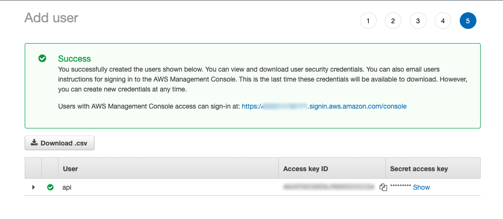
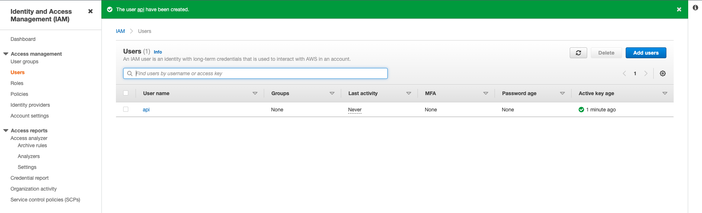

# Criando permissões do AWS IAM para o AWS S3

O Identity and Access Management (IAM) é onde todas as permissões de acesso são criadas para qualquer serviço da AWS.

Nele é possível especificar regras gerais e granulares para serviços e ações realizadas por outros serviços, por
usuários registrados na sua conta AWS e por outras contas AWS que precisam ter acesso aos seus recursos.

Neste tutorial vamos criar um usuário com permissões genéricas para manipular objetos no bucket do S3 criado neste 
tutorial.

### Passo 1:
No painel principal do seu IAM selecione a opção `Users` (`Usuários`) no menu esquerdo, em seguida clique no botão ao
lado direito superior `Add users` (`Adicionar Usuários`).

### Passo 2:
- Dê um nome ao seu usuário.
- Selecione a opção `Access key - Programmatic access` (`Chave de acesso: acesso programático`). Este usuário não 
poderá logar no painel de controle, e terá acesso somente via API da AWS.

### Passo 3:
Para este tutorial vamos usar uma política de segurança pronta, disponibilizada pela AWS. 

Clique no campo de busca e digite `s3`. Em seguida selecione a opção `AmazonS3FullAccess`.

**ATENÇÃO**: A política `AmazonS3FullAccess` dá acesso completo a todos os seus Buckets no S3, por isso tenha em 
mente que as credenciais geradas devem ser muito bem protegidas e mantidas em isolamento no seu ambiente de produção.
Não comite ou compartilhe estas credenciais.

### Passo 4:
Você pode inserir tags nesta etapa, mesmo não sendo obrigatórias, elas podem ajudá-lo ao visualizar relatórios
e quando opera sua conta exclusivamente via AWS API.

### Passo 5:
Confira as propriedades do usuário e prossiga criando o usuário.

### Passo 6:
Nesta tela você tem acesso às credenciais de acesso do usuário criado. Você pode baixar as credenciais em formato CSV.

### Passo 7:
Agora seu novo usuário será visível na listagem de usuários.

