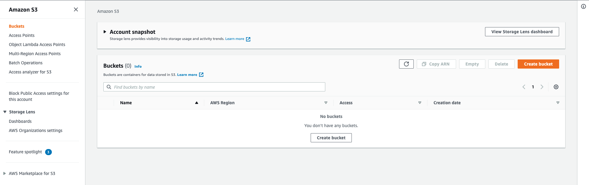
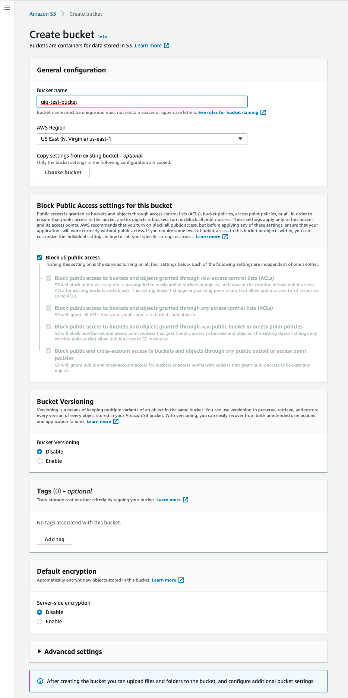
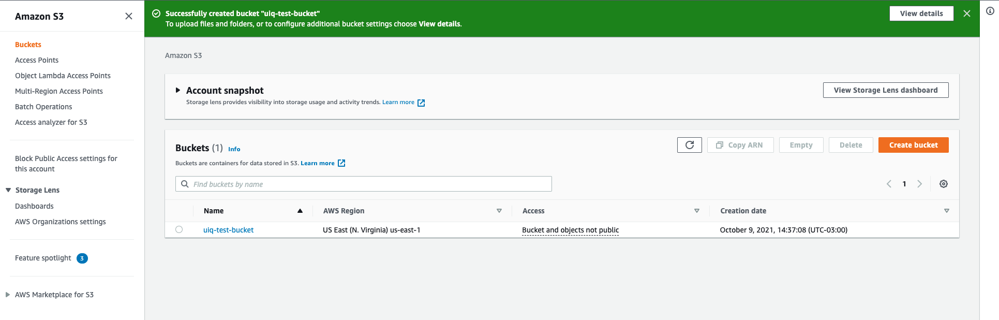
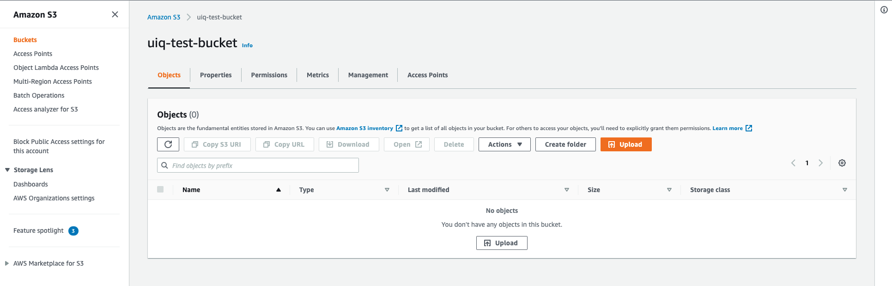
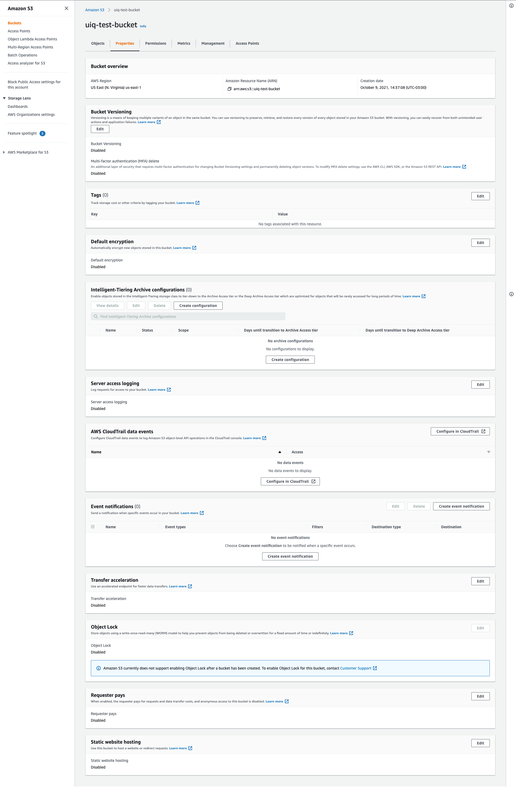
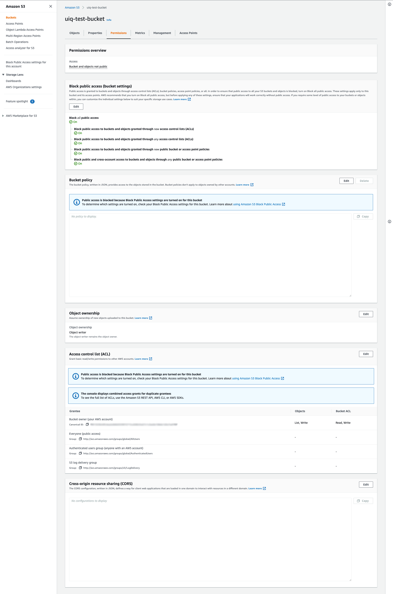
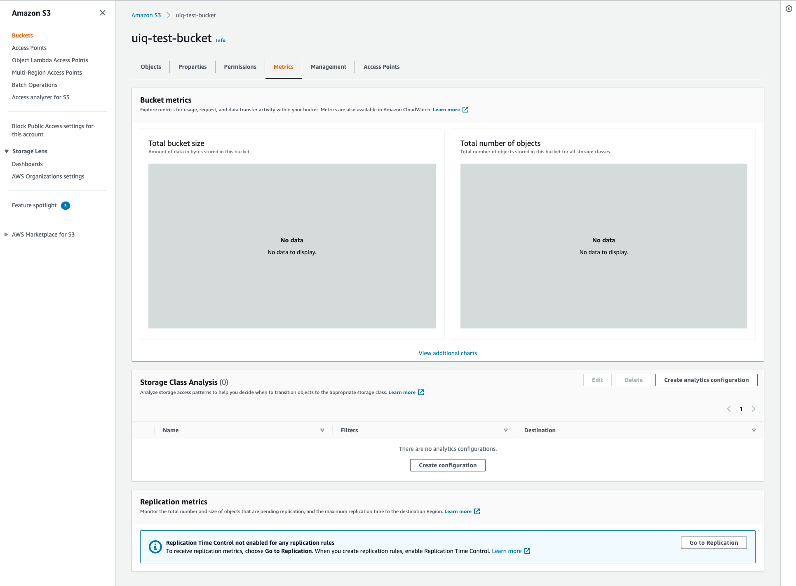
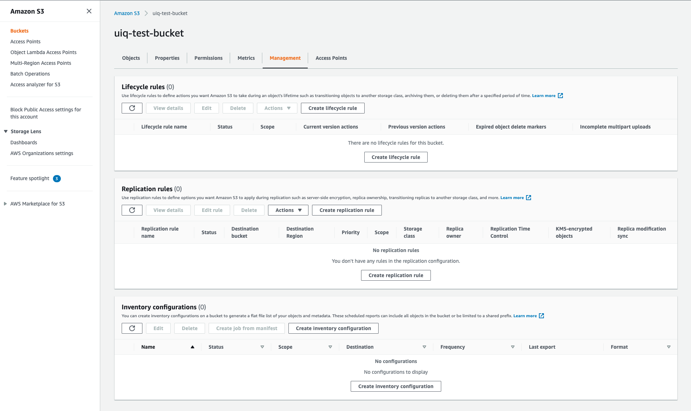
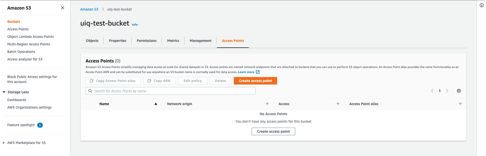

# Criando um bucket no AWS S3

Um Bucket nada mais é que um espaço de armazenamento, ou o equivalente de uma partição do disco do seu computador,
porém, com a vantagem de estar em nuvem e ser replicado em vários servidores e data centers diferentes garantindo
a integridade e a redundância dos seus arquivos.

### Passo 1:
No seu painel do S3 clique no botão `Create Bucket` (`Criar Bucket`) no lado direito superior da tela.



### Passo 2:
- Defina o nome do seu Bucket. Lembre-se que o nome do Bucket deve ser único não só na sua conta, mas globalmente,
por isso utilize um nome que inclua por exemplo, o nome do seu projeto.
- Selecione a região onde deseja que o Bucket seja criado.
- Desmarque a opção `Block all public access` caso deseja expor o conteúdo do Bucket publicamente. (NÃO RECOMENDADO)
- Selecione a opção de `Bucket Versioning` caso se aplique.
- Adicione tags se desejar.
- Selecione a opção de `Bucket Encryption` caso se aplique.
- Clique no botão `Create`.



### Passo 3:
Agora com seu Bucket criado ele aparecerá na listagem, clique sobre ele para prosseguirmos.



### Passo 4:
Esta é a tela de objetos do seu Bucket onde você pode fazer upload e listar seus arquivos, além de executar 
ações de remoção e alteração das propriedades individuais dos seus objetos.



### Passo 5:
Na aba `Properties`(`Propriedades`) você vai visualizar os seguintes itens:
- **Bucket Overview**: Dados gerais sobre seu Bucket.
- **Bucket Versioning**: Visualizar e alterar as configurações de versionamento do seu Bucket.
- **Tags**: Adicionar ou editar as tags do seu Bucket. Útil para distinguir seu Bucket nos relatórios da sua conta
incluindo relatórios financeiros.
- **Default Encryption**: Definir e alterar as opções de criptografia para proteger os dados armazenados no seu Bucket.
- **Intelligent-Tiering Archive configurations**: Aqui você pode definir as configurações de mudança de estado ou modo
de armazenamento dos objetos do seu bucket, fazendo com que eles utilizem modos de armazenamento diferentes dependendo
das regras aplicadas para diminuir os custos de armazenamento.
- **Server Access Logging**: Você pode habilitar os logs de acesso ao seu bucket. Útil para monitorar atividades em
buckets que armazenam dados sensíveis.
- **AWS CloudTrail data Events**: O Amazon S3 é integrado ao AWS CloudTrail, um serviço que fornece um registro das 
ações realizadas por um usuário, role ou serviço AWS no Amazon S3. O CloudTrail captura um subconjunto de 
chamadas de API do Amazon S3 como eventos, incluindo chamadas do console do Amazon S3 e chamadas de código das 
APIs do Amazon S3.
- **Event Notifications**: Voc6e pode configurar eventos baseados em ações executadas dentro do seu Bucket e emitir
notificações para filas de SQS, SNS ou até invocar funções lambda para tomarem ações baseadas nestes eventos.
- **Transfer Acceleration**: Você pode habilitar ou desabilitar a aceleração de transferência de dados globais.
- **Object Lock**: Você pode habilitar o modo write-once-read-many (WORM) que permite gravar um objeto mas impede a 
remoção do mesmo por um determinado tempo ou permanentemente.
- **Requester Pays**: Você pode habilitar o modo de pagamento de custos do bucket por terceiros.
- **Static website hosting**: Habilitando este modo você serve o conteúdo do seu bucket com um site estático. Atente-se
aos custos de requisições e transferências que esse modo incorre.



### Passo 6:
Na aba `Permissions` (`Permissões`) você vai ser capaz de alterar de alterar as propriedades de acesso do seu bucket.
- **Permissions overview**: Resumo das permissões.
- **Block public access**: Defina o nível de acesso público aos objetos do bucket.
- **Bucket policy**: Defina as políticas de acesso aos objetos do bucket.
- **Object ownership**: Defina as permissões de acesso dos proprietários dos objetos.
- **Access control list (ACL)**: Grupos de permissões de acesso para outras contas AWS. 
- **Cross-origin resource sharing (CORS)**: Regras de acesso por domínio de origem da requisição.



### Passo 7:
Métricas de acesso ao bucket e aos seus objetos.



### Passo 8:
Gerencie as configurações de ciclo de vida de objetos, replicação e inventário.



### Passo 9:
Os pontos de acesso são endpoints de rede são anexados a buckets que você pode usar para 
realizar operações de objeto S3.



## Exportando as variáveis de ambiente

Para permitir que o script de teste possa encontrar o bucket criado é necessário exportar a seguinte variável de 
ambiente com o nome do bucket que acabou de criar:

```shell
export TUTORIAL_BUCKET=uiq-test-bucket
```


